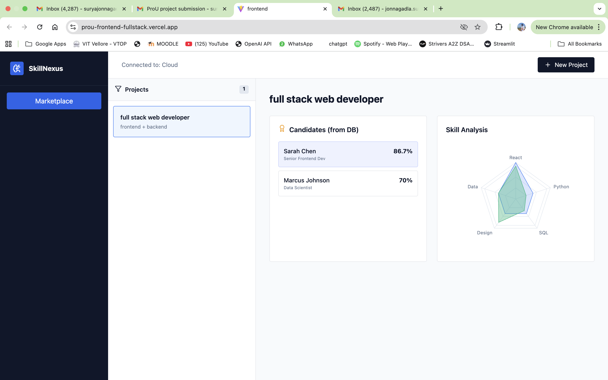
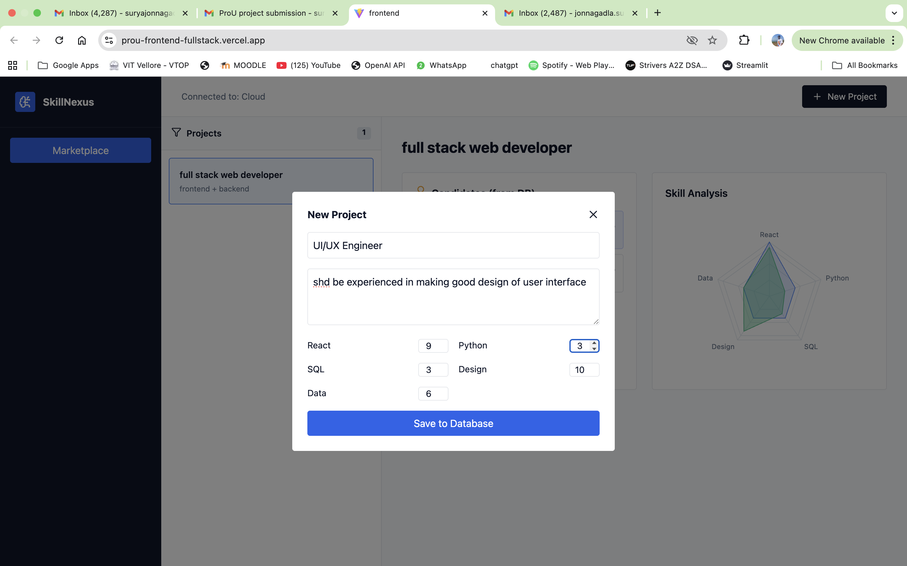
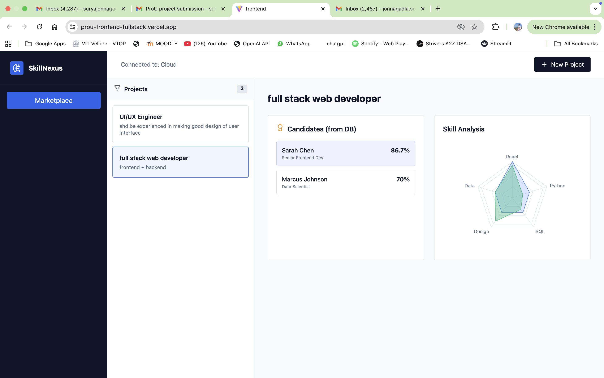
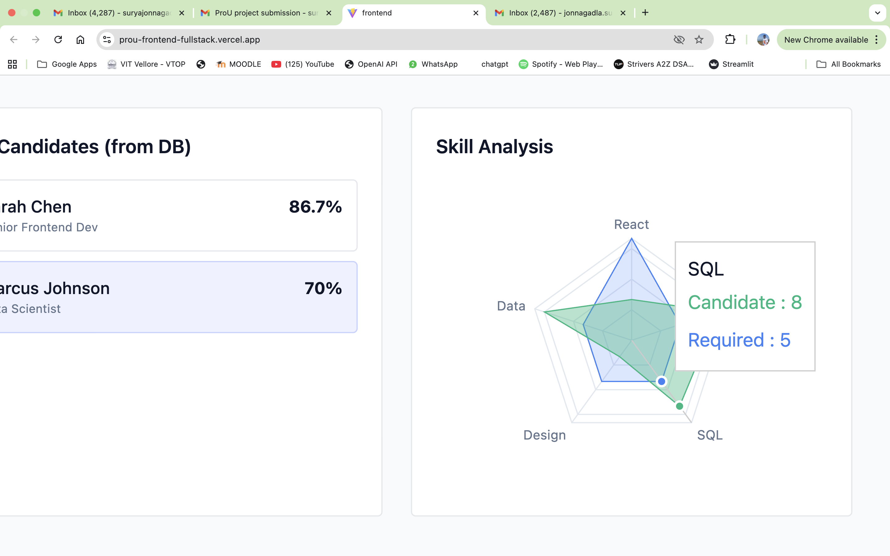
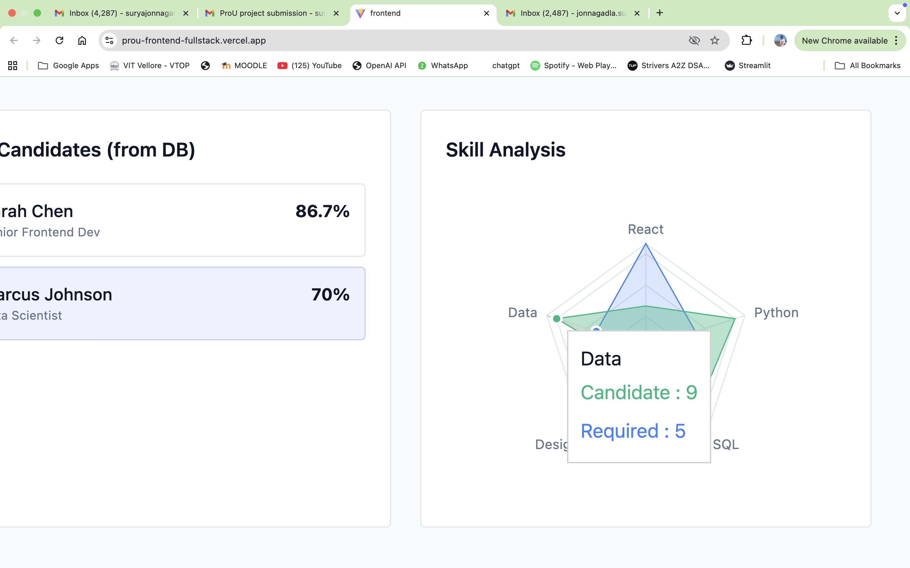

SkillNexus - Intelligent Internal Talent Marketplace (Frontend)

 Overview

SkillNexus is a React-based Internal Talent Marketplace designed for "ProU". It allows project managers to post new R&D initiatives and automatically matches them with the most suitable internal employees based on a Weighted Skill Matching Algorithm.

This repository contains the Frontend UI, built with React and Tailwind CSS, featuring interactive data visualizations to analyze skill gaps.

Live Demo Link (Vercel):https://prou-frontend-fullstack.vercel.app/

 Tech Stack

Framework: React.js (Vite)

Styling: Tailwind CSS

Visualization: Recharts (Radar Charts for Skill Gap Analysis)

Icons: Lucide React

Deployment: Vercel

 Key Features

Smart Matching Dashboard: Instantly visualizes which employees match a project's requirements.

Skill Gap Analysis: Interactive Radar Chart comparing a project's required skills vs. a candidate's actual skills.

Dynamic Forms: Create new projects with specific skill weightings (React, Python, Data, etc.).

Responsive Design: Fully responsive layout with mobile-compatible sidebar and navigation.

 Screenshots:
 
Main Dashboard showing active projects and candidate matches.

Radar Chart visualizing the skill overlap.

 Setup Instructions

Clone the repository:

git clone [https://github.com/Surya-j2004/prou-frontend-fullstack.git](https://github.com/Surya-j2004/prou-frontend-fullstack.git)
cd prou-frontend-fullstack

Install Dependencies:

npm install

Run Locally:

npm run dev

The app will open at http://localhost:5173.

 Backend Connection

This frontend connects to a separate Python/FastAPI backend.

 Bonus Challenges Completed

Full Stack Implementation: Separated Frontend and Backend repositories.

Deployment: Live on Vercel.

Data Visualization: Implemented Radar Charts for complex data representation.

Creative UX: Clean, modern "Enterprise" dashboard design.
